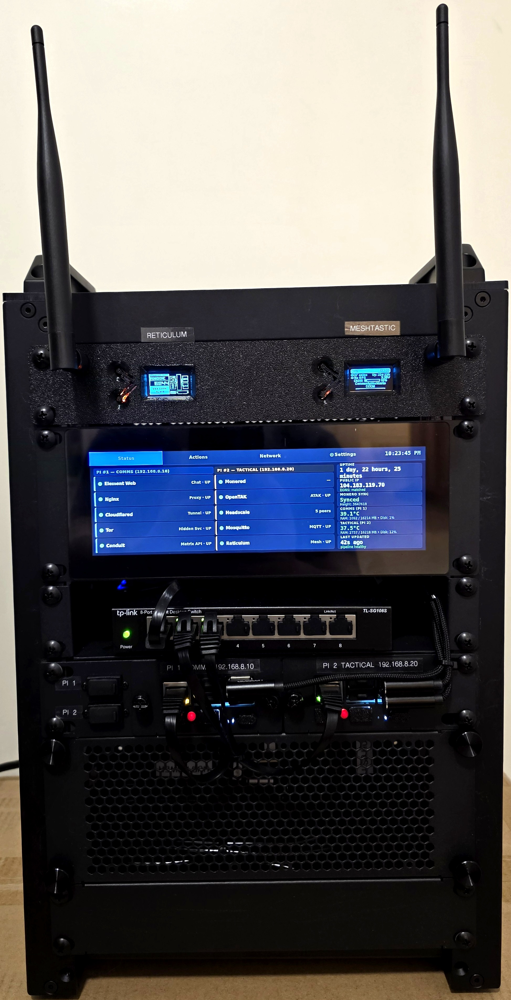

# M2 Community Node

Field-portable communications node in an 8U 10" mini-rack. Dual Raspberry Pi 5 16GB. All hardware, all open source, all yours.



**License:** [CC BY-NC-SA 4.0](LICENSE) — free to use, adapt, and share non-commercially with attribution.

**Network diagram:** [`docs/M2_Network_Diagram.drawio`](docs/M2_Network_Diagram.drawio) — renders on GitHub · open in [app.diagrams.net](https://app.diagrams.net) to edit or print

---

> ## Before You Start — Read This
>
> **This repository is a build plan, not a plug-and-play installer.** It is a complete, step-by-step blueprint for constructing and configuring a field-portable community communications node from commodity hardware. Prior hardware or networking expertise is NOT a hard requirement — but only if you go in with realistic expectations and the right support.
>
> **This node was built successfully with the help of an AI companion (Claude) assisting at every step** — walking through commands, catching configuration errors, explaining tradeoffs, and adapting to the specific hardware and environment as it came up. That approach is **strongly recommended** for anyone attempting this build. The build guide contains every command and every config, but this is a complex, multi-service system and the reality of standing it up involves:
>
> - Configuration decisions that depend on your specific domain, hardware, and use case
> - Gotchas in third-party software (OpenTAKServer, Conduit, Headscale) that are not documented upstream
> - Network and firewall behaviors that vary by router model and ISP
> - Security choices around access tiers, credentials, and certificate management that require deliberate decisions
> - Unexpected states during setup that require diagnosis, not just copy-paste
>
> **The recommendation:** Work through the build guide with an AI assistant — Claude, ChatGPT, or similar — that can read the docs alongside you, adapt commands to your environment on the fly, and help you reason through the decisions. This is not a project where you follow the guide blindly and expect it to work. It is a project where you follow the guide with a knowledgeable collaborator and build something that actually fits your community.
>
---

## What It Does

A self-contained tactical and community communications hub that fits in a shoebox-sized rack and deploys in under 15 minutes:

- **ATAK / OpenTAK Server** — shared tactical map, CoT, GeoChat, voice (Mumble)
- **Matrix / Element** — encrypted group chat with federation
- **Meshtastic** — LoRa mesh radio (1–5 km, no internet needed)
- **Reticulum / RNode** — encrypted mesh transport backbone
- **Monero** — community privacy node
- **Tor + I2P** — censorship-resistant access paths
- **Headscale** — self-hosted VPN for remote operator access
- **Offline Maps** — PMTiles street-level maps + DTED2 terrain data

**Cost:** ~$994 (recommended build) | ~$889 (budget, single Pi) | [See all build options →](docs/BUILD_OPTIONS.md)

---

## Repository Layout

```
M2-Community-Node/
├── docs/               ← EVERYTHING YOU NEED TO BUILD IS IN HERE (including network diagram)
├── operational-pdfs/   Print-ready operational documents (build guide, runbook, field cards)
├── community-outreach/ Community marketing package (booth handouts, recruiting materials)
├── scripts/            PDF generators, QR tools, status bot, deploy scripts
├── config/             Service config templates (Conduit, Nginx, Tor, I2P, etc.)
├── svg/                Generic QR code SVGs (app downloads, LAN Element)
├── 3d-models/          STL files for 3D-printed rack accessories
├── kiosk-assets/       Offline map libraries for the kiosk display
├── docker-compose.yml          Pi #1 (comms) service stack
└── docker-compose.tactical.yml Pi #2 (tactical) service stack
```

---

> **The `docs/` folder is the build.** Every phase, every command, every config decision lives there. The hardware BOM, the step-by-step build guide, the event runbook, troubleshooting — all of it. If you are building a node, open `docs/` and start with `PREREQUISITES.md`. Do not skip it.

---

### docs/

All reference documentation. Read in this order if you're building:

| Document | What it covers |
|---|---|
| [PREREQUISITES.md](docs/PREREQUISITES.md) | What you need before you start |
| [HARDWARE_BOM.md](docs/HARDWARE_BOM.md) | Complete BOM — every part, ASIN, and price |
| [BUILD_OPTIONS.md](docs/BUILD_OPTIONS.md) | Hardware alternatives — Pi 4, mini PCs, single-device, no-Monero builds |
| [MASTER_PLAN.md](docs/MASTER_PLAN.md) | Architecture, service inventory, network layout |
| [M2_Network_Diagram.drawio](docs/M2_Network_Diagram.drawio) | Full network diagram — all services, ports, connectivity paths |
| [BUILD_GUIDE.md](docs/BUILD_GUIDE.md) | **Main build guide — 13 phases, every command** |
| [ATAK_CONNECTIVITY.md](docs/ATAK_CONNECTIVITY.md) | Operator onboarding — 3 access tiers (LAN, clearnet, VPN) |
| [EVENT_RUNBOOK.md](docs/EVENT_RUNBOOK.md) | Day-of-event: power-on, POST, onboarding, teardown |
| [ATAK_SAR_PLUGINS.md](docs/ATAK_SAR_PLUGINS.md) | ATAK plugin audit and SAR recommendations |
| [ATAK_RETICULUM_MESH.md](docs/ATAK_RETICULUM_MESH.md) | Mesh layer deep dive (OTS + Reticulum + Meshtastic) |
| [ELEMENT_PLAN.md](docs/ELEMENT_PLAN.md) | Matrix / Element space planning and federation |
| [MONERO_NODE.md](docs/MONERO_NODE.md) | Monero node installation and operation |
| [SERVICE_MAP.md](docs/SERVICE_MAP.md) | Port map and network layout quick reference |
| [TROUBLESHOOTING.md](docs/TROUBLESHOOTING.md) | Symptom-based field reference — WiFi, ATAK, Matrix, Monero |
| [NETWORK_CUSTOMIZATION.md](docs/NETWORK_CUSTOMIZATION.md) | Changing subnets, DHCP, and firewall rules |
| [CLOUDFLARE_SETUP.md](docs/CLOUDFLARE_SETUP.md) | DNS and tunnel setup for clearnet access |
| [DISASTER_RECOVERY.md](docs/DISASTER_RECOVERY.md) | Backup, restore, and failover procedures |
| [QR_CODES.md](docs/QR_CODES.md) | QR code generation and deployment workflow |
| [FIELD_LAPTOP_SETUP.md](docs/FIELD_LAPTOP_SETUP.md) | Operator laptop config for remote field use |
| [MAINTENANCE.md](docs/MAINTENANCE.md) | Service updates, version management, credential rotation |

### operational-pdfs/

Print-ready documents for building and operating the node. Generated from the source docs — regenerate after any doc change by running the corresponding script from `scripts/`.

| PDF | Description | Regenerate with |
|---|---|---|
| `M2_Community_Node_Build_Book.pdf` | Full build guide — print for the workbench | `generate_build_book.py` |
| `M2_Community_Node_Runbook.pdf` | Event operations runbook | `generate_runbook.py` |
| `M2_Community_Node_Troubleshooting.pdf` | Field troubleshooting reference | `generate_reference_pdfs.py` |
| `M2_Rack_Wiring_Diagram.pdf` | Cable routing and power chain diagrams | `generate_m2_wiring_diagram.py` |
| `M2_ATAK_FieldCard.pdf` | 3.5×5.5" laminated ATAK setup card | `generate_field_card.py` |

### community-outreach/

Marketing and recruiting materials for events and community engagement. These are not build documentation — they are handouts for people who haven't built a node yet. Live in `community-outreach/pdf/`, generated by scripts in `community-outreach/scripts/`.

| PDF | Description |
|---|---|
| `M2_Snapshot.pdf` | 2-page booth handout — services, capabilities, cost |
| `M2_Build_Summary.pdf` | BOM summary, cost tiers, build timeline |
| `M2_PACE_Card.pdf` | PACE framework reference card |
| `M2_New_Member_Card.pdf` | 3.5×5.5" laminated new member onboarding card |

### scripts/

PDF generators, operations tools, and deploy scripts.

| Script | What it does |
|---|---|
| `generate_build_book.py` | Build Book PDF from `docs/BUILD_GUIDE.md` |
| `generate_runbook.py` | Runbook PDF from `docs/EVENT_RUNBOOK.md` |
| `generate_reference_pdfs.py` | Troubleshooting PDF from `docs/TROUBLESHOOTING.md` |
| `generate_m2_wiring_diagram.py` | Rack wiring diagram PDF |
| `generate_field_card.py` | ATAK field card PDF (3.5×5.5") |
| `generate_qr.py` | QR code SVGs — WiFi, app downloads, onion services |
| `generate_vinyl_labels.py` | Vinyl cut labels for rack panels |
| `generate-status.py` | Live service status page renderer |
| `m2-status-bot.sh` | Status bot launcher (systemd timer, posts to Matrix) |
| `m2-post-matrix.py` | Post a message to a Matrix room |
| `m2-event-space.py` | Manage Matrix event spaces for activations |
| `make_atak_dp.py` | Build an ATAK data package for quick enrollment |
| `push_node_marker.py` | Push node GPS marker to OpenTAK Server |
| `set_node_icon.py` | Set the node icon in OpenTAK Server |
| `instance_config.py` | Instance config loader (reads `instance.conf`) |
| `systemd/` | Systemd service and timer units for the status bot |

### config/

Service configuration templates. Copy each to its final location on the Pi before deploying — do not fill in secrets here.

| Path | Service |
|---|---|
| `config/conduit/conduit.template.toml` | Conduit Matrix homeserver |
| `config/element/element-config.json` | Element Web client |
| `config/nginx/nginx.conf` | Reverse proxy |
| `config/tor/torrc` | Tor daemon |
| `config/i2pd/i2pd.conf` | I2P daemon |
| `config/mosquitto/mosquitto.conf` | MQTT broker (Meshtastic bridge) |

### svg/

QR code SVGs for printed materials and kiosk modals. Two workflows — see [docs/QR_CODES.md](docs/QR_CODES.md).

- `qr-wifi.svg`, `qr-atak-connect.svg`, `qr-community-page.svg`, `qr-element-clearnet.svg` — physical panel vinyl cutouts
- Remaining QRs — kiosk modal use only
- `WebQrCodes/` — vinyl-quality QR set (generated via mini-qr)

### 3d-models/

STL files for 3D-printed rack accessories. Print in PETG or ABS.

- SMA bulkhead / Keystone mount for 1U panel (left + right versions)
- 2U fan side plates
- Heltec V3 LoRa radio faceplate
- RFID module housing (top + bottom)
- Meshtastic 10" rack panel model

---

## Quick Start

**Everything below points into `docs/`. That folder is where the build lives.**

### 1. Get the hardware

[docs/HARDWARE_BOM.md](docs/HARDWARE_BOM.md) — complete parts list with prices and purchase links.

### 2. Read the prerequisites

[docs/PREREQUISITES.md](docs/PREREQUISITES.md) — accounts, tools, and decisions to make before touching hardware. Do this first.

### 3. Follow the build guide

[docs/BUILD_GUIDE.md](docs/BUILD_GUIDE.md) — every command, every config, from bare hardware to a running node. This is the primary document.

### 4. Set up credentials

Copy `M2_SECRETS.template.md` to `M2_SECRETS.md` and fill in your values. The filled file is gitignored — never commit it.

Copy `instance.conf.template` to `instance.conf` and fill in your network-specific values.

Copy `kiosk-config.js.template` to `kiosk-config.js` and fill in your OTS credentials before deploying the kiosk.

### 5. Deploy the kiosk

Copy `kiosk.html`, `index.html`, `kiosk-map.html`, `kiosk-assets/`, and your filled `kiosk-config.js` to `/home/pi/node-ui/` on Pi #1.

---

## Contributing

This project is documentation and tooling, not application code. If you build one and find errors, improvements, or gotchas — open an issue or PR. All contributions must be compatible with CC BY-NC-SA 4.0.

Questions or feedback: open an issue on GitHub.

---

## Special Thanks

This project would not exist without the vision, community, and mission of three organizations that helped build the idea, necessity, and reasoning behind it:

- **[Carolina Capabilities Co-Op](https://www.carolinacapabilitiesco-op.com/)** — community resilience and preparedness, built from the ground up
- **[Light Fighter Manifesto](https://lightfightermanifesto.org/)** — the framework and philosophy driving the mission
- **[Light Fighter Homefront Initiative](https://lightfighterhomefront.org/)** — putting that mission into practice at the community level

The inspiration and architecture for this project couldn't have been done without the first iteration built by **Christopher M. Rance**. Go support the group or join a chapter — [instagram.com/christopher_m_rance](https://www.instagram.com/christopher_m_rance/)

---

## License

[Creative Commons Attribution-NonCommercial-ShareAlike 4.0 International](LICENSE)

You can build one for your community. You cannot sell it. If you publish your own version, use the same license.
